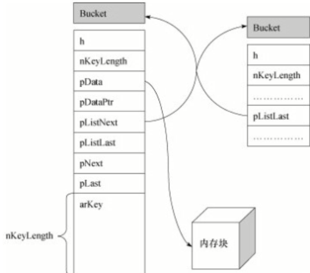

# 7 PHP扩展开发

###### 20180208

## 7.1 为什么要开发PHP扩展

1. 应用非常注重效率，如复杂的图像算法
2. 有些系统调用不能用PHP直接访问
3. 想商业化一个应用，但是又不想暴露源代码
4. 其他。。。

## 7.2 搭建PHP扩展框架

### 7.2.1 PHP源代码目录

一些主要的目录和文件：`ext`,`main`,`pear`,`sapi`,`TSRM`,`Zend`,
`main/php.h`,`Zend/zend.h`,`Zend/zend_API.h`

### 7.2.2 ext_skel工具

PHP内核开发人员为编写PHP扩展提供的“自动构建系统”工具

### 7.2.3 Windows平台环境配置

VC++，PHP源代码

1. 使用ext_skel工具
```bash
php ext_skel_win32.php --extname=myext
```

2. 编译安装扩展

3. mv Release/php_myext.dll /path/to/ext/php_myext.dll

4. 配置
```ini
extension=php_myext.dll
```

### 7.2.4 Linux平台环境配置

1. 安装PHP dev包
2. 使用ext_skel工具
```bash
./ext_skel --extname=myext
Creating directory myext
Creating basic files: config.m4 config.w32 .gitignore myext.c php_myext.h CREDITS EXPERIMENTAL tests/001.phpt myext.php [done].
To use your new extension, you will have to execute the following steps:
$ cd ..
$ vi ext/myext/config.m4
$ ./buildconf
$ ./configure --[with|enable]-myext
$ make
$ ./sapi/cli/php -f ext/myext/myext.php
$ vi ext/myext/myext.c
$ make
Repeat steps 3-6 until you are satisfied with ext/myext/config.m4 and
step 6 confirms that your module is compiled into PHP. Then, start writing
code and repeat the last two steps as often as necessary.
```
修改ext/myext/config.m4，
```m4
PHP_ARG_ENABLE(myext, whether to enable myext support,   
dnl Make sure that the comment is aligned:
[  --enable-myext           Enable myext support])
```
3. 编译安装扩展
```bash
cd ext/myext
phpize
./configure --with-php-config=/data/webserver/php/bin/php-config
make
make test
make install
```
4. 配置
```ini
extension=myext.so
```

### 7.2.5 PHP的生命周期

Module init -> Request init -> Request shutdown -> Module shutdown

最常见的四种启动PHP的方式：
1. 直接以CLI/CGI模式调用
2. 多进程模块
3. 多线程模块
4. Embedded（嵌入式，在自己的C程序中调用Zend Engine）

SAPI提供一个接口，使得PHP可以和其他应用进行交互数据。
在命令行运行PHP程序的主要流程：

```txt
php -f test.php
Call each extension's MINIT                     |
Request test.php                    |           |
Call each extension's RINIT         |           |
Execute test.php                     }Indivdual  }PHP
Call each extension's RSHUTDOWN     | Request   | Lifesspan
Finish cheaning up after test.php   |           |
Call each extension's MSHUTDOWN                 |
Terminate php                                   |
```

## 7.3 PHP内核中的变量

### 7.3.1 PHP变量在内核中的存储方式

```c
typeof union _zvalue_vlaue {
    long lval;
    double dval;
    struct {
        char *val;
        int len;
    } str;
    HashTable *ht;
    zend_object_value obj;
    zend_ast *ast;
} zvalue_value;
struct _zval_struct {
    zvalue_value value; // 变量的值
    zend_unit refcount__gc; // 变量引用数
    zend_uchar type; // 变量的类型
    zend_uchar is_ref__gc; // 变量是否被引用
};
#define IS_NULL 0
#define IS_LONG 1
#define IS_DOUBLE 2
#define IS_STRING 3
#define IS_ARRAY 4
#define IS_OBJECT 5
#define IS_BOOL 6
#define IS_RESOURCE 7
```

### 7.3.2 PHP内核变量访宏

为了解决PHP版本升级后，自建的扩展不可用，PHP内核提供了一个
访问和设置变量类型和值的方法
```c
Z_TYPE(zval) // 对应zval结构体的实体
Z_TYPE_P(&zval) // 对应zval结构体的指针
Z_TYPE_PP(&&zval) // 对应zval结构体的二级指针
Z_LVAL(lvar) // 对应变量的值
```

### 7.3.3 引用计数器与写时复制

PHP不支持指针，为了两个变量能同时指向同一内存块，PHP变量
引入了引用计数器

is_ref: bool值，标志变量是否是应用集合
refcount: 计算指向引用集合的变量个数

`写时复制`是一个解决内存复用的方法，当变量的值改变时才进行
内存的复制

## 7.4 PHP内核中的HashTable分析

PHP内核中的HashTable和传统的HashTable实现基本一致，但是增加了一些
特性（如同时维护一个双链表）

### 7.4.1 PHP内核HashTable的数据结构

```c
struct _hashtable;
typedef struct bucket {
    ulong h; // 保存经过hash函数处理之后的hash值
    uint nKeyLength; // 保存索引的长度
    void *pData; // 指向保存的内存块地址
    void *pDataPtr; // 保存指针数据
    struct bucket *pListNext; // 指向双向链表的下一个元素
    struct bucket *pListLast; // 指向双向链表的上一个元素
    struct bucket *pNext; // 指向具有同一个hash值的下一个元素
    struct bucket *pLast; // 指向具有同一个hash值的上一个元素
    const char *arKey; // 保存索引，而且必须为最后一个成员
} Bucket;
typedef struct _hashtable {
    uint nTableSize; // 记录Bucket数组的大小
    uint nTableMask; // 
    uint nNumOfElements; // 记录HashTable中元素个数
    ulong nNextFreeElement; // 下一个可用的Bucket位置
    Bucket *pInteralPointer; // 遍历HashTable元素
    Bucket *pListHead; // 双向链表表头
    Bucket *pListTail; // 双向链表表尾
    Bucket **arBuckets; // Bucket数组
    dtor_func_t pDesctructor;
    zend_bool presistent;
    unsigned char nApplyCount;
    zend_bool bApplyProtection;
#if ZEND_DEBUG
    int inconsistent;
#endif
} HashTable;
```



### 7.4.2 HashTable的代码实现

## 7.5 Zend API详解与扩展编写

### 7.5.1 什么是Zend引擎

Zend引擎是脚本语言引擎（解析器+虚拟机），主要的工作就是解析、翻译和执行PHP脚本

1. 编译PHP脚本，输出Opcodes
2. 解析执行Opcodes，输出结果

### 7.5.2 Zend引擎内存管理

Zend引擎提供一些与内存管理相关的接口，Zend引擎会管理所有通过Zend API
申请的内存，从而避免了内存泄露

### 7.5.3 PHP扩展的架构

###### 20180208
